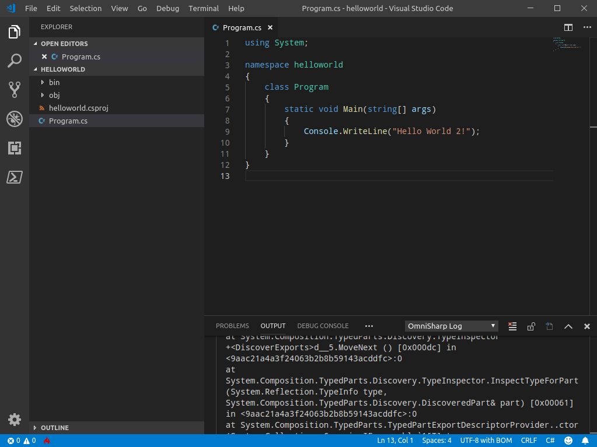

### Grossemy Romain
### Campistron Thomas

IFI
===

On vous demande de tester et d'évaluer l'installation de différentes solutions afin de fournir afin de fournir à des développeurs un environnement prêt à l'emploi pour faire du développement d'application client/serveur 3-tiers avec ASP.NET MVC.

------------------

Visual Studio
=============

Visual Studio Entreprise Edition
--------------------------------

| Négatif | Positif |
|---------|---------|
| Payante |         |
| Disponible seulement sur MacOS / Windows |   |
| \>5Go  |  |

Visual Studio Code
------------------

| Négatif | Positif |
|---------|---------|
| Disponible sous MacOS / Linux / Windows | Gratuit |
| Pas de gestion de projet| Opensource |
| Pas dans les repos | \<100Mo |
| Ce n'est pas un IDE mais un éditeur de texte | |
| OmniSharp ne fonctionne pas nativement avec ArchLinux => il génère un projet en dotNET 2.2 alors qu'il utilise une version d'Omnisharp qui ne supporte pas cette version| |

JetBrains Rider
===============

| Négatif | Positif |
|---------|---------|
| Payant  | |
| Non intuitif => on a pas réussi à le faire fonctionner du premier coup | |
| Propriétaire -> Pas dans les repos | |
| \>5Go | |

Eclipse
=======
| Négatif | Positif |
|---------|---------|
| Il faut utiliser un plugin aCute pour faire du C# | Gratuit |
| | Simple d'utilisation |
| | Opensource -> Dans les repos |
| | \< 500Mo |

